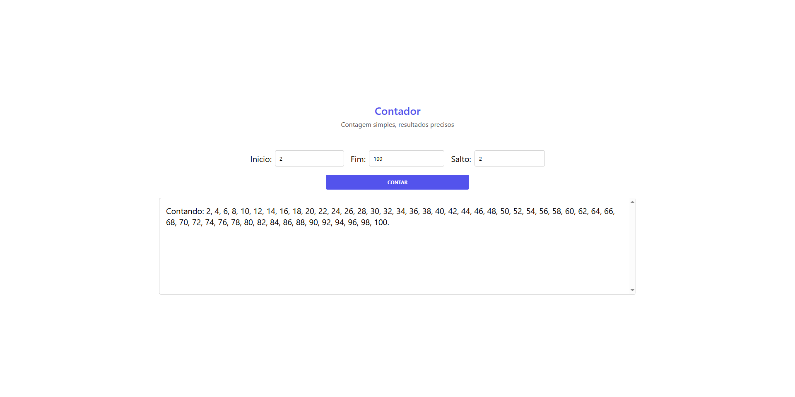
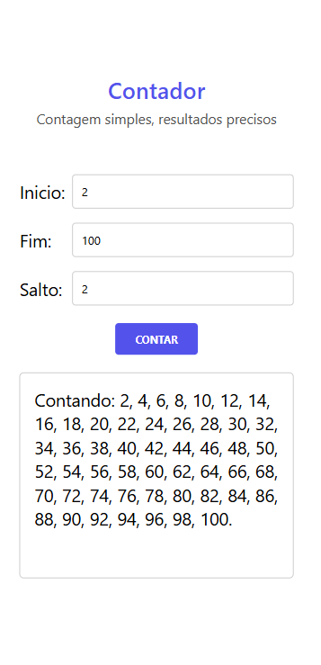

# CountStep

## Preview

<p align="center">
  
  
</p>

## Funcionalidades

- Contagem progressiva (crescente) e regressiva (decrescente)
- Definição de valor inicial, valor final e salto entre os números
- Salto padrão de 1 quando não informado ou inválido
- Validação visual dos campos obrigatórios
- Suporte a envio pelo teclado (tecla Enter)
- Layout responsivo para dispositivos móveis

## Tecnologias

- HTML5
- CSS3
- JavaScript (Vanilla)

## Como Usar

1. Informe o valor de **Inicio** (número inicial da contagem)
2. Informe o valor de **Fim** (número final da contagem)
3. *(Opcional)* Informe o valor de **Salto** (intervalo entre os números — padrão: 1)
4. Clique em **Contar** ou pressione **Enter**
5. O resultado aparece na área abaixo do formulário

> Se o valor de início for maior que o valor de fim, a contagem será feita de forma decrescente automaticamente.

## Como Rodar o Projeto

Nenhuma instalação ou dependência necessária. Basta abrir o arquivo `index.html` diretamente no navegador:

```bash
# Clone o repositório
git clone https://github.com/seu-usuario/contador.git

# Acesse a pasta
cd contador

# Abra no navegador
start index.html   # Windows
open index.html    # macOS
xdg-open index.html # Linux
```

Ou use a extensão **Live Server** no VS Code para servir o projeto localmente.

## Estrutura do Projeto

```
contador/
├── index.html          # Estrutura da página
├── index.js            # Lógica da contagem
├── style.css           # Estilos
├── assets/
│   ├── icons/
│   │   └── contagem.png        # Favicon
│   └── images/
│       ├── preview-desktop.png # Preview desktop
│       └── preview-mobile.png  # Preview mobile
└── README.md
```
